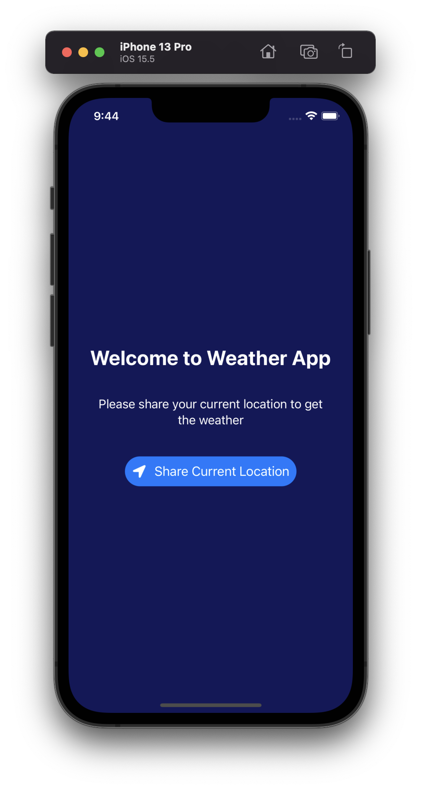

# Weather App
Learning iOS Development with SwiftUI: Build a weather app

|  |  |
--- | ---

## Feature
### V1.0
- Get latitude & longitude based user location
- Read API from openweathermap.org
- CoreLocation

## Pembelajaran
### V1.0
- Read JSON dari API -> dengan menggunakan struct decodable (https://designcode.io/swiftui-advanced-handbook-data-from-json)
- Belajar tentang CoreLocation di file locationmanager.swift
- Untuk data statis dapat menggunakan JSON file
- Melakukan fetch data di belakang layar ketika sedang loading dgn .task
- AsyncImage untuk meload image dari internet
- Membuat tampilan rounded dengan extensions
- Deploy & install app tanpa harus pakai testflight (https://yuvsinha01.medium.com/install-and-share-ipa-file-on-ios-without-using-testflight-7a8709a6ceb5)
- Gimana cara setup .env ya di swiftui?

## Next Features
- Pilihan kota, provinsi di Indonesia
- Lokasi based on kota
- Widget cuaca dgn kota dinamis
